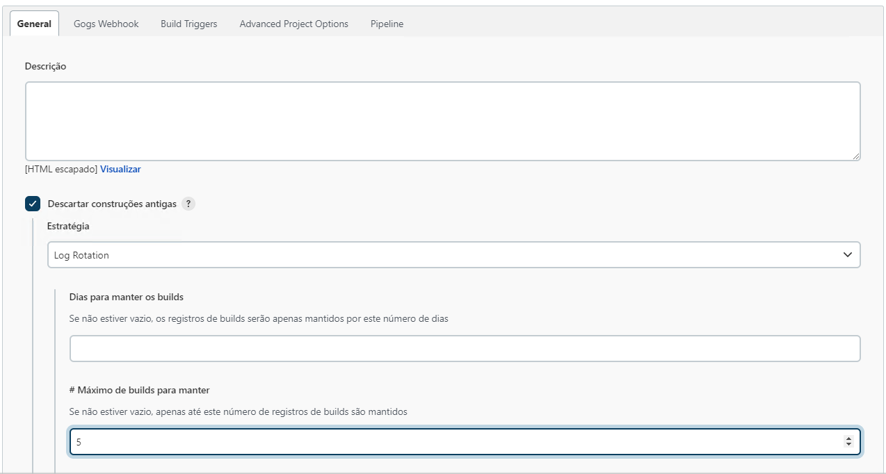
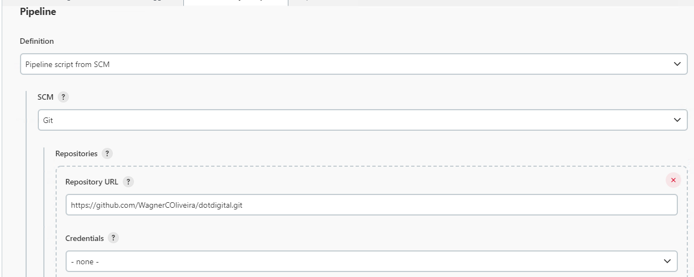

# Instalação e Configuração Jenkins

## Projeto de CI/CD.

Tabela de conteúdos
=================
<!--ts-->   
   * [Questão](#questão)   
   * [Tecnologias](#-tecnologias-utilizadas)
   * [Contribuição](#contribuição)
   * [Autor](#autor)
   * [Licença](#licença)
<!--te-->

### Questão

Provisione duas instâncias de máquinas virtuais (preferencialmente na AWS) via Terraform. Utilizando o Ansible, em uma das VMs, faça a instalação de uma ferramenta de CI/CD e configure uma pipeline de deploy para uma aplicação open-source de sua escolha (ou faça uma simples API com um endpoint de retorno), tendo como destino para este deploy a segunda VM, onde a aplicação irá rodar. (Envie o endereço do git com a execução da tarefa)

#### Criação .env

O arquivo **.env** será criaado pela playbook do ansible na raiz do projeto com as seguintes variaveis.

~~~bash
    JAVA_OPTS=-Djenkins.install.runSetupWizard=false -Dhudson.footerURL=https://jenkins.example.com.br
    JENKINS_USER=maracanau
    JENKINS_PASS=SUA_SENHA_AQUI
~~~

#### Configurações Jenkins Job

1. Configuração de rotação dos logs.

2. Adicionando projeto git.

3. Adicionando **Branch** e path do **Jenkinsfile**

### 🛠 Tecnologias Utilizadas

As seguintes ferramentas foram usadas na construção do projeto:

- [Docker 20.10.12](https://docs.docker.com/engine/)
- [Docker Compose 1.29.2](https://docs.docker.com/compose/)
- [jenkins LTS](https://www.jenkins.io/doc/book/getting-started/)

### Contribuição

- Wagner Oliveira

### Autor

- Wagner Oliveira

### Licença

- [GNU General Public License (GPL)](https://www.gnu.org/licenses/gpl-3.0.html)
